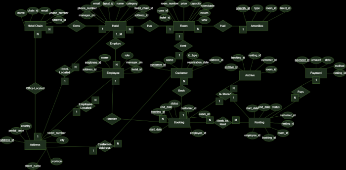
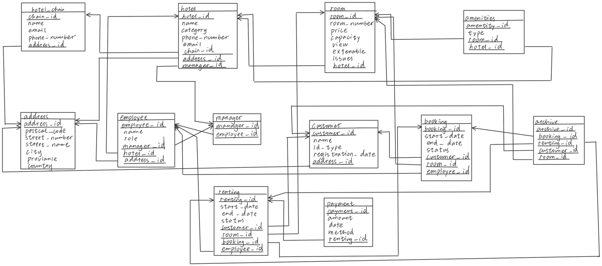

# E-Hotel Database Management System

A relational database system designed to support hotel booking and management operations, including hotel chains, hotels, rooms, customers, employees, bookings, rentals, payments, and archived records.

This project was developed as a university database systems project and focuses on relational database design and SQL implementation.

## Technologies

- MySQL
- SQL
- Java
- JSP / Servlets
- Apache Tomcat

## Key Features

- Designed an ER model and relational database schema
- Implemented tables with primary and foreign key constraints
- Populated the database with sample hotel, room, customer, and booking data
- Created SQL queries using joins, aggregation, and nested queries
- Implemented database triggers for business rules
- Created indexes to improve query performance
- Created SQL views for room availability and hotel capacity
- Maintained booking and rental records

## Database Design

### ER Diagram



### Relational Schema



## Repository Structure

```text
e-hotel-database-system/
│
├── database/
│   ├── 01_schema.sql
│   ├── 02_sample_data.sql
│   ├── 03_queries.sql
│   ├── 04_triggers.sql
│   ├── 05_indexes.sql
│   └── 06_views.sql
│
├── design/
│   ├── er-diagram.png
│   └── relational-schema.png
│
├── web-app/
│   ├── src/
│   └── web/
│
└── README.md

## SQL Implementation

The database directory contains the SQL implementation of the project.

01_schema.sql

Creates the database tables, relationships, keys, and constraints.

02_sample_data.sql

Populates the database with sample data used to test the system.

03_queries.sql

Contains SQL queries used to retrieve and analyze data from the database.

04_triggers.sql

Contains database triggers used to support system rules and database operations.

05_indexes.sql

Creates indexes used to improve database query performance.

06_views.sql

Creates SQL views for frequently accessed and summarized database information.

## Database Entities

The database includes the following main entities:

Hotel Chain — stores information about hotel chains and their contact details
Hotel — stores individual hotel information including location and category
Room — stores room information such as price, capacity, amenities, and availability-related attributes
Customer — stores registered customer information
Employee — stores hotel employee information and roles
Booking — manages customer room reservations
Renting — records actual hotel room stays
Payment — stores payments associated with rentals
Archive — maintains historical booking and rental information

## My Contributions

My primary contribution to this group project focused on the database design and SQL implementation.

My work included:

Database design
Relational schema development
SQL table implementation
Database population
SQL queries
Database triggers
Views
Indexes

The web application component was implemented by other members of the project team and is included in this repository to demonstrate how the database was integrated into the complete system.

## Web Application

The complete group project also included a web application developed using Java, JSP/Servlets, and Apache Tomcat.

The application connects to the MySQL database and provides an interface for hotel booking and management operations.

The web application source code is located in:

web-app/

## Project Context

This project was developed as part of a university database systems course.

The main goal was to design and implement a relational database capable of supporting hotel booking and management operations while applying database concepts such as relational modeling, integrity constraints, SQL queries, triggers, indexes, and views.
